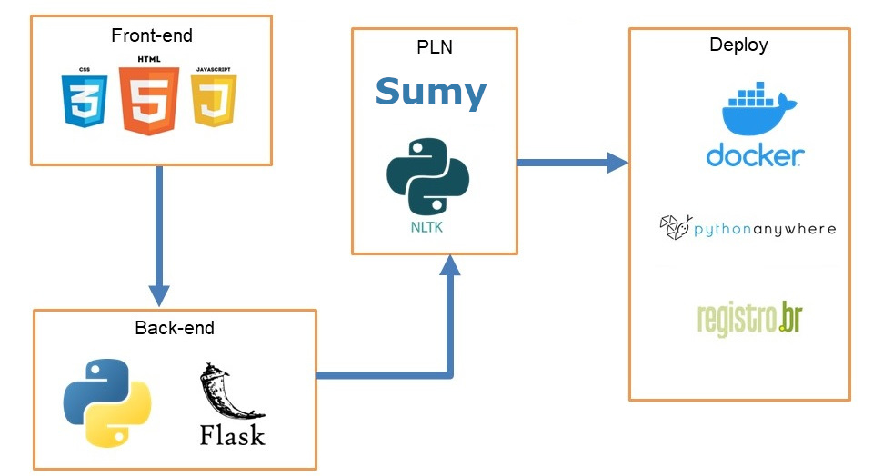

# To-Point
<i>A tecnologia da informação como apoio para apresentar pontos
essenciais de um conteúdo escrito</i>

## Índice

- [Sobre](#about)
- [Como Rodar o Projeto](#run)

## Sobre <a name = "about"></a>

Este projeto de software que tem como objetivo entregar um produto que possa ajudar estudantes, professores e outros profissionais a entender os pontos principais que estão sendo discutidos em artigos, livros, entre outros documentos em um curto espaço de tempo.

A principal tecnologia utilizada nesse projeto foi o processamento de linguagem natural com técnica de sumarização de textos para transformar a linguagem natural em informações manipuláveis por máquinas.

<br>

<div align="center">
<i> Ferramentas utilizadas</i>
<br>

</div>

<br>

### A aplicação web

Na figura 1, pode ser visto a tela de início da aplicação e as opções disponíveis
para o usuário. Inicialmente insere-se um link de uma página web ou um arquivo PDF
ou TXT que contenha um conteúdo textual, na sequência, vai aparecer os níveis de
redução para serem aplicados no texto e a opção de dar feedback na parte de baixo
da tela. O botão “sobre” é para o usuário conhecer um pouco sobre do que se trata o
projeto, e por fim, a tecla gerar que irá iniciar o processo de redução do texto.

<div align="center">
<i>Figura 1 – Tela de início</i>
<br>

</div>

<br>

Na figura 2, o usuário inseri um link de uma página web, depois seleciona o
nível de redução que o conteúdo é reduzido, neste caso, o nível selecionado foi o
médio, que inclusive é o nível padrão, em seguida o usuário clicou no botão “Gerar” e
então aparece um ícone de carregamento, indicando que o conteúdo está sendo
validado pelo sistema, iniciando o processo de geração do resumo.

<div align="center">
<i>Figura 2 – O sistema está processando o conteúdo</i>
<br>

</div>

<br>

 A figura 3 aponta onde o resumo é exibido, por esse motivo a opção “Somente
Resumo” está marcada. Ela irá mostrar somente a parte do texto que o algoritmo de
processamento natural julgou importante. É possível ver também que existe um
anúncio na parte superior da tela, abaixo do logo da aplicação, anúncios são gerados
aleatoriamente para que a aplicação retorne algum tipo de receita.

<div align="center">
<i>Figura 3 – Visualizando somente o resumo gerado</i>
<br>

</div>

<br>

Na figura 4 tem-se a mesma tela de visualização do resumo mostrado na figura
anterior, a diferença é que a opção “Somente Resumo” está desmarcada, significa
que o sistema irá mostrar o conteúdo original extraído do arquivo ou site e, em realce,
irá mostrar as principais sentenças escolhidas pelo algoritmo de processamento de
linguagem natural. Existe acima do resumo gerado, um botão com o nome “Exportar
Texto”, a função desse botão é exportar o conteúdo extraído para o formato PDF.

<div align="center">
<i>Figura 4 – Tela de visualizar o resumo com o conteúdo original</i>
<br>

</div>

<br>

A figura 5 é a tela para visualizar a nuvem de palavras. Essa janela é aberta
quando o usuário clica no botão “Nuvem de Palavras”, desta forma, é mostrado para
o usuário as palavras-chave do conteúdo escrito, o tamanho da palavra indica a sua
importância no texto. Na parte de baixo da janela existe um botão chamado “Exportar”,
ele exporta a nuvem de palavras no formato PNG.

<div align="center">
<i>Figura 5 – Tela de visualizar a nuvem de palavras</i>
<br>

</div>

<br>

A figura 6 tem-se uma introdução da função do software e objetivos do
projeto, logo abaixo, ao lado do nome do desenvolvedor que projetou o software, tem
a opção de “Feedback”, é onde o usuário do sistema pode deixar críticas e sugestões.
Todo feedback é enviado para o e-mail do desenvolvedor do software.

<div align="center">
<i>Figura 6 – Tela que descreve o objetivo do projeto</i>
<br>

</div>

<br>

## Como Rodar o Projeto <a name = "run"></a>
### Requisitos
  - <a href="https://www.docker.com/">Docker</a>

<br>

Dentro da pasta onde esta o arquivo <b>Dockerfile</b>, abra o terminal e execute o comando

```
docker image build -t topoint . 
```
Esse comando irá criar executar as instruções definidas no arquivo Dockerfile, criando uma imagem docker chamada topoint.
<br>

Após finalizar a criação da imagem, rode o comando abaixo para criar o container

```
docker run --name to-point -p 5000:5000 -d topoint 
```

Com o container criado e em execução, acesse o endereço 
http://localhost:5000 para utilizar a aplicação.

<br>

Quando terminar de utilizar aplicação não se esqueça de parar o container utilizando o comando:

```
docker container stop to-point
```
